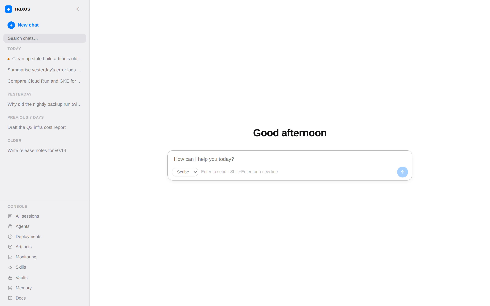
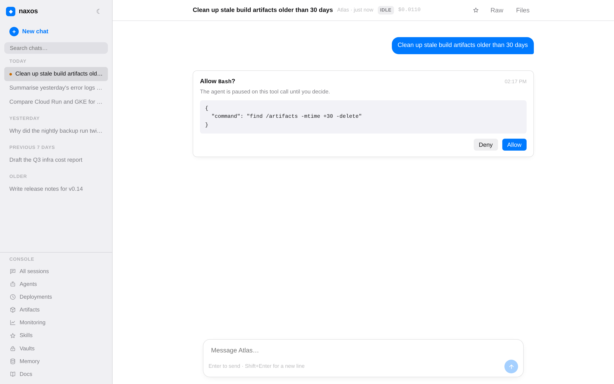

# naxos

A Google Cloud implementation of Claude Managed Agents: versioned agents, isolated per-session sandboxes on Cloud Run, an event-sourced session API with SSE streaming, approval gates, vaults with an egress credential proxy, scheduled deployments, and full execution-level audit — inside a single GCP project with Vertex AI as the only model exit.

- Docs site: [yoichiojima-2.github.io/naxos](https://yoichiojima-2.github.io/naxos/)
- Design: [`docs/design.md`](docs/design.md)
- Constraints and conventions: [`CLAUDE.md`](CLAUDE.md)

A session timeline: event stream, tool calls, and a human approval gate

## Why

Hosted agent platforms run the agent loop and sandbox on the provider's cloud. naxos exists for workloads that can't leave your own boundary:

- **Data boundary** — model access via Vertex AI only; data never leaves the project.
- **Internal-system integration** — self-hosted MCP servers reach closed-network systems without egress.
- **Connectors without connector code** — Slack, Google Workspace, Notion, Jira, Confluence and GitHub attach as existing MCP servers, either self-hosted in the project or reached through the credential proxy. See [`docs/connectors.md`](docs/connectors.md).
- **Execution-level governance** — human approval gates, an instant per-agent kill switch, and per-tenant IAM.
- **An execution record you can hand to an auditor** — every tool call an agent attempted, recorded by the control plane at the permission gate: who asked, who approved, the arguments, the decision, and what came back. Queryable and exportable over `/v1/tool_calls`, and it outlives the session it describes.
- **Scale-to-zero** — always *available* rather than always running; idle sessions checkpoint to storage and release their container.

## Layout

| Path | What |
|---|---|
| `control-plane/` | FastAPI service — `/v1` REST + SSE (`api` entrypoint) and the sandbox/scheduler/reconciler internal surface (`internal` entrypoint) |
| `sandbox-runner/` | Per-session sandbox: Claude Agent SDK loop, permission hook, budget, checkpoint/resume |
| `egress-proxy/` | Credential-substituting proxy — vault secrets never enter the sandbox |
| `shared/` | Pydantic event/config models shared by the three services |
| `ui/` | Next.js static export, baked into the control-plane image |
| `terraform/` | One root module; `environments.json` fans out per-environment SA / Job / bucket / IAM, `connectors.json` fans out the self-hosted MCP connector services |
| `docs/` | Design docs |

## Status

Under active development — see the roadmap in [`docs/design.md`](docs/design.md) §11.

## License

[MIT](LICENSE)
